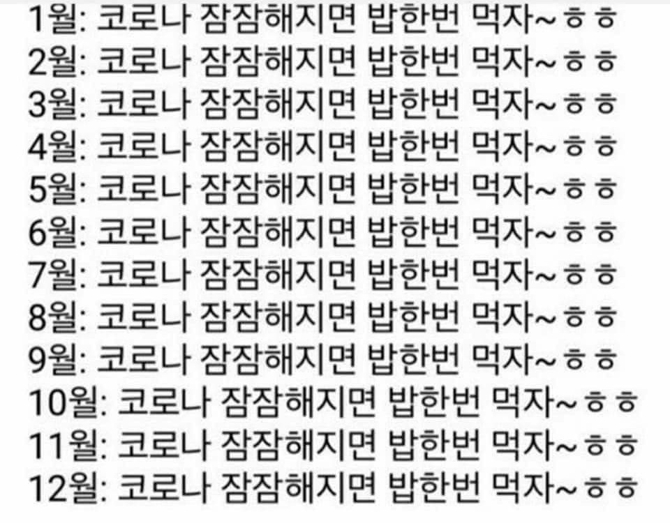

[돌아보는 2019년 한 해](https://velog.io/@hw0knam/2019-log)

약 1년 전에 작성했던 2019년 회고 글이다.

이제는 졸업도 하고 '벌써 회사를 1년 반 동안 다니고 있구나..' 하고 느낄 정도로 시간이 정말 빠르게 지나갔다. 그만큼 시간 가는 줄도 모르고 어딘가에서 고생했을 나에게 박수를 보내고 싶다.

그래서 이번 회고는 큼지막한 주제별로 정리하되, 2020년 가장 기억에 남았던 몇 가지 일만 적어보려고 한다. 내년에 조금 더 많은 것들을 남겨놓을 수 있기를 빈다.

## 커리어 & 스킬

**좋았던 부분**

- 수많은 경험 속 역량 향상
- 하나의 분야에만 치중되지 않았던 것

**아쉬웠던 부분**

- 탄탄한 설계를 하지 못했던 순간들

### 수많은 경험 속 역량 향상

2020년에는 프로젝트 팀만 크게 2번 옮겼고, 그마저도 flexible하게 어딘가 리소스가 필요하면 잠시 도와줬다가 다시 원래의 일을 하기도 했다. 고생하고 나면 그만큼 뒤에 남는 게 많다고 했었는데, 실제로 그랬던 한 해였다.

특히 React Native를 하면서 OAuth, 카카오링크, Remote 푸시 알림, 네이티브 모듈, 카메라, 위젯, 백그라운드 태스크, 버전업, CodePush 셋업과 사용, Fastlane 셋업과 사용 등 해볼 수 있는 것들은 거의 다 해본 것 같다. 이외에도 React 웹 프론트엔드, Node.js 백엔드, GCP 기반 인프라 등 생각하면 정리하기 어려울 정도였다.

이렇게 한 해를 지내면서 자연스레 지식이 많이 확장되었다. 지식이 확장된 만큼 특정 기술이 아닌 클린 코드, 디자인 패턴같은 본질적인 것, 변하지 않는 것들도 배우게 되었고, 결과적으로 **2019년에 비해 더 좋은 코드 퀄리티를 확보**하게 되었다.

학생 시절에 개발자는 현업 3년차까지 가파르게 성장한다는 말을 주워들은 적이 있다. 2020년에 해왔던 것들을 돌아보면서 그 의미를 잘 알게 되었고 실제로 그렇게 성장한 것 같아 뿌듯했다.

### 하나의 분야에만 치중되지 않았던 것

프론트엔드 개발자가 프론트엔드 분야의 전문성을 키우는 건 정말 중요하다. 그러나 백엔드(혹은 다른 분야)에 대한 이해가 없으면 설계를 비효율적으로 할 수 밖에 없다. 그래서 나는 막 공부했을 당시에도 풀스택 어플리케이션을 구현하며 공부했고, 취업 준비를 했을 당시 프론트엔드를 내세웠으나 어느 정도의 백엔드 (REST API, 데이터베이스, ORM) 지식까지도 준비해두었다.

시간이 지나면서 프론트엔드에 조금 더 애착을 가지고 커리어를 쌓아가고 있다. 그렇지만 나는 회사에서 백엔드도 가끔 하고, 주로 쓰는 언어 혹은 프레임워크가 아닌 다른 것도 틈틈이 배우면서 해보고 있다. 최근에는 파이썬에 관심이 생겨서 간단한 알고리즘 문제를 파이썬으로도 풀어보며 적응해보고 있다.

하나에만 치중하지 말자는 소소한 다짐이 2020년에도 잘 이루어진 것 같아 기분이 좋다. 확실히 큰 그림 그리기를 잘 할 수 있는 원동력이 되어준 것 같아 그런 다짐을 했던 나를 칭찬해주고 싶다.

### 탄탄한 설계를 하지 못했던 순간들

어떤 일을 처음 하면 대부분 시행착오를 겪는다. 그리고 그 시행착오를 바탕으로 해서 다음엔 이렇게 해야겠다는 걸 깨닫고 점점 발전하게 된다. 그 과정에서 이미 잘못 진행한 것에 대해 아쉬움이 남는 건 어쩔 수 없는 것 같다.

2020년에 많은 경험을 해서 그런지, 미흡했던 것들에 대한 아쉬움이 많았다. 내가 조금만 더 신경써서 설계했었다면 어땠을까?

그런데, 그것보다 중요한 건 **잘못된 점을 깨닫고 다시 고치려는 액션들이 더 중요하다**는 걸 알았다. 아직 시간을 되돌릴 수 있는 방법을 모르니까 문제를 고치고 같은 실수를 2번 하지 않는 게 최선이라고 생각한다. ~~물론 문제가 일어나지 않는 게 베스트 :)~~

빠르게 성장한 댓가로 생긴 아쉬운 부분이었다. 성장하는 것도 중요하지만 이런 trade-off를 생각하며 속도조절을 하는 것도 중요해보인다.

## 기타

**좋았던 부분**

- 무탈하게 한 해를 보낸 것

**아쉬웠던 부분**

- 사람을 덜 만난 것
- 자랑할만한 스스로의 성과 부재

### 무탈하게 한 해를 보낸 것

2020년은 진짜 운빨이 좋았던 것 같다. 일단 이 무서운 코로나 시국에서 건강하게 살고 있는 것부터, 코로나 디버프가 무색하게도 올해 모든 일들이 착착 맞아떨어지는 기분이었다.

연초에 신체검사를 받은 이후 기회가 생겨 3일만에 산업기능요원 복무를 시작했고, 기회가 생겨 많은 프로젝트를 오가며 성장할 수 있었다. 또 기회가 생겨 나름 좋은 집으로 이사했고, 기회가 생겨 훈련소도 원하는 날짜에 편하게 다녀왔다.

그냥 "해보고 싶은데..." 하면 어딘가에서 기회를 줬던 한 해였다. 그 덕에 코로나 시국 치고는 정말 무탈하게 보낸 것 같아서 내년이 오히려 걱정된다.

### 사람을 덜 만난 것

이거만큼 2020년을 잘 요약한 짤이 없는 것 같다.

올해 만나보고 싶은 사람들은 진짜 많았지만 정작 많이 만나지는 못했고, 대부분의 컨퍼런스들이 온라인으로 전환되거나 취소됐다. 자연스럽게 서로 마주보고 얘기하는 기회 자체가 적어지는 게 싫어서, 어서 코로나가 세상에서 사라졌으면 하는 마음이다.

### 자랑할만한 스스로의 성과 부재

이번 년도에는 스스로 뭔가 해보고 싶은 것들이 많이 있었다. 혼자 손질해서 블로그 만들기, 리액트로 만든 스도쿠 새로운 버전 만들기, 외부 발표 1회 이상 하기 등 개인적인 목표 여러 가지가 있었는데, 이룬 건 지금 이 블로그 하나뿐이고 어떤 것들은 시도조차 못 해봤던 것도 있다.

이랬던 원인은 실천하기 위한 노력이 부족했고, 오롯이 나만을 위해 쓰는 시간이 적었던 것 같다. 이렇게까지 나에 대해 신경을 쓰지 않으면 머지않아 지칠 수 있겠다는 생각이 들었다.

열일하는 건 좋지만 자기계발하는 시간은 일단 확보해놓고 봐야겠다. 당장은 이 시간을 어떻게 쓸까 고민하겠지만 지금 모니터 옆에 놓여있는 노트와 펜으로 To-do랑 아이디어들 아무렇게나 적어놓고 그냥 그것들을 시작하면 좋지 않을까?

## 2021년에는

- **블로그 포스트 20개 이상 작성하기** - 2주에 1번 정도 쓴다고 생각하고 도전해봐야겠다. 대신 실패한 것 같을 땐 마지막에 몰아쓰기보다는 아예 실패를 당당히 인정하는 게 더 좋겠다.
- **좋은 팀원 되기** - 두말할 것 없다.
- **내가 몰랐던 지식과 개념들 배우기** - a11y, i18n, 클린 아키텍처, WebAssembly, 인프라, 이외에도 많은 것들을 배우려고 한다.
- **Figma 능숙하게 다루기** - 배워두면 진짜 쓸모있어 보여서 일단 이 블로그의 썸네일 중 99%는 Figma로 작업해서 채워보려고 한다.

---

> "해보지 않고서는 당신이 무엇을 해낼 수 있는지 알 수 없습니다."
>
> \- Adam Franklin
