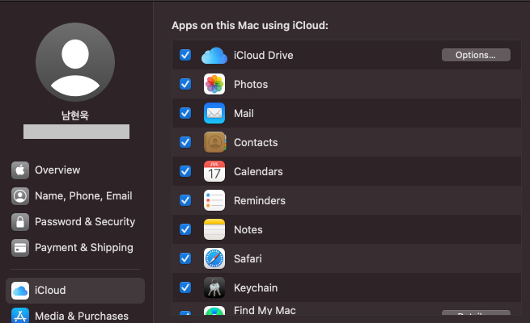
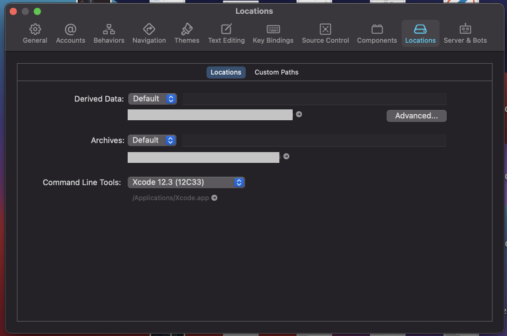
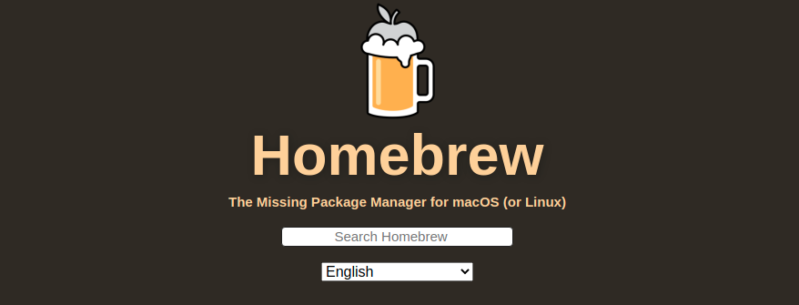
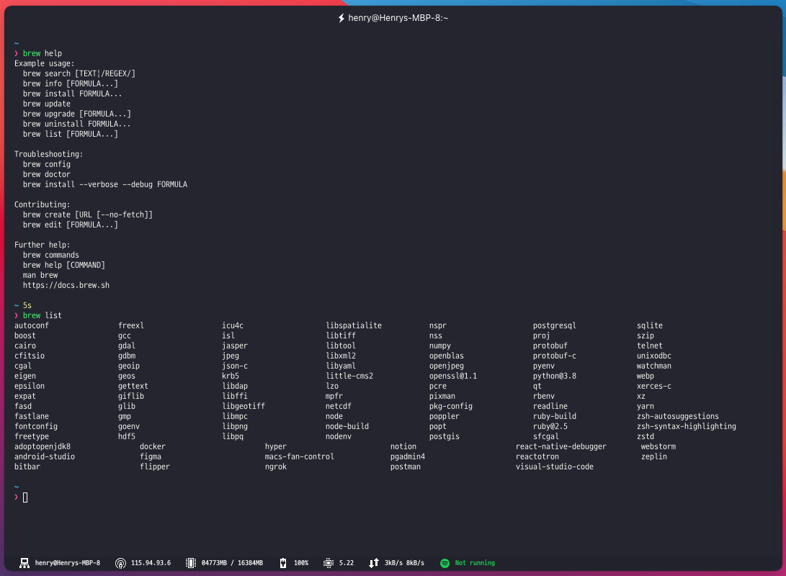
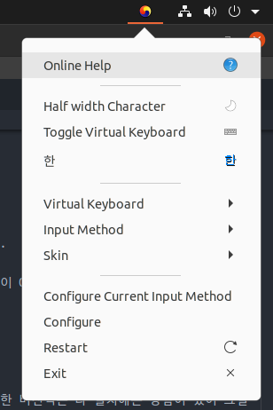
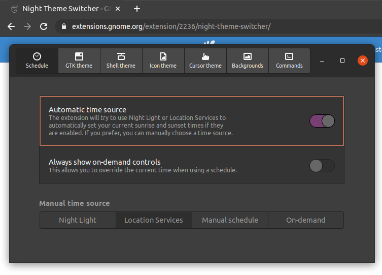
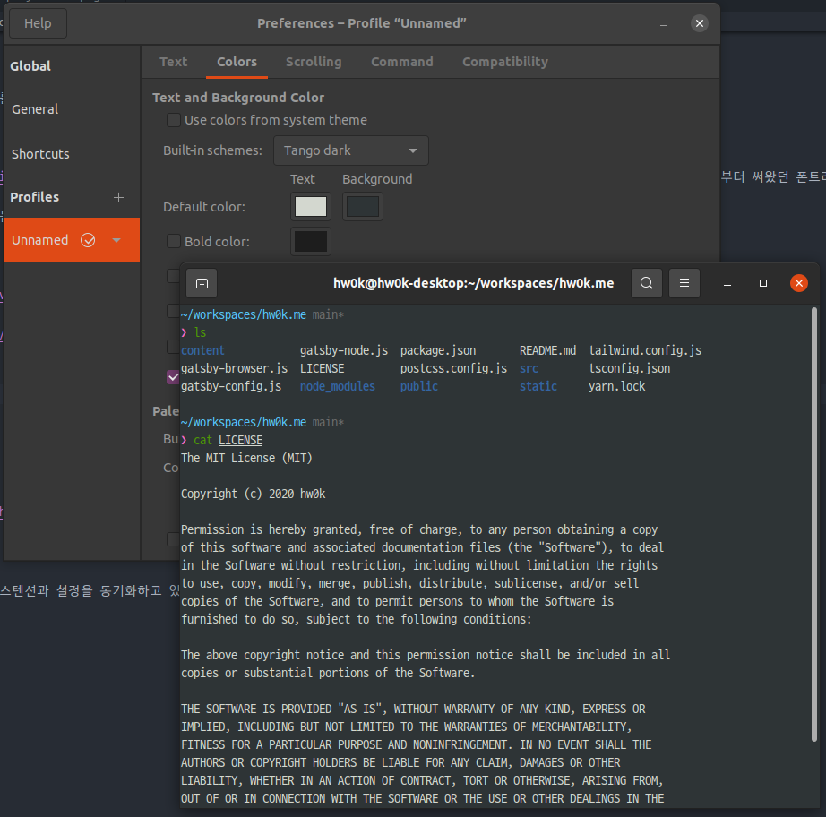
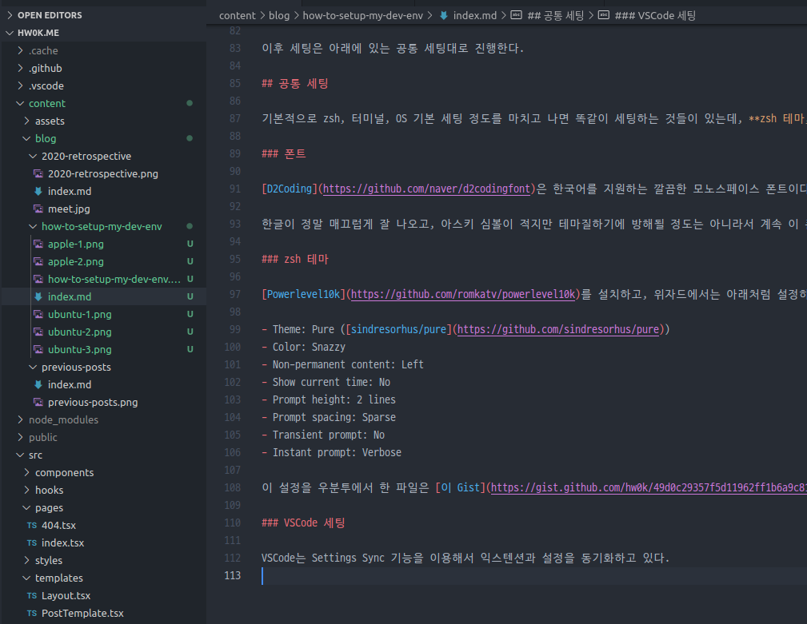

마음을 잡고 개발하려면 마음가짐이 제일 중요하지만, 개발 환경을 잘 구축하는 것 또한 빠질 수 없다. 이번 포스트에서는 내가 개발 환경을 세팅하는 방법을 공개하려고 한다.

## Mac에서의 세팅

나는 맥을 엄청 좋아한다. 작년에 훈련소 가기 전 개인용 데스크탑을 맞췄는데, 훈련소를 수료하고 폰을 보다가 애플 실리콘 맥이 나왔다는 소식을 보고...... 지인 찬스를 최대한 노리면서 데스크탑을 팔 준비를 하고 있다.

아무튼 약 2년 정도 맥을 사용해오면서 포맷 & 세팅을 여러 번 거쳐온 경험으로 개발 환경을 세팅하는 방법을 알려주려고 한다.

### Apple 계정 셋업

제일 먼저, 내가 사용하고 있는 Apple 계정에 로그인하고 대부분의 동기화 옵션을 켠다.

단순히 맥에 영역표시를 하는 일이지만 동기화를 켬으로써 진정한 애플 생태계의 연동성이 시작된다고 봐도 무방한 것 같다.

### XCode 설치 & Command Line Tools 셋업

앱 스토어에서 XCode를 설치한다. 설치가 완료되면 XCode의 Preferences에서 Command Line Tools를 고르고 설치한다.

보통 이 과정은 정말 오래 걸리기 때문에 해놓고 식사를 하거나, 다른 일을 보거나, 페어 코딩을 하러 간다.

### Homebrew 설치 & 기초 셋업

[Homebrew](https://brew.sh/index_ko)는 맥 전용 패키지 관리 툴이다. 데비안 계열의 [apt](<https://en.wikipedia.org/wiki/APT_(software)>)와 같이, 필요한 것을 **명령어 한 줄로 설치할 수 있고** 그것들을 알아서 업데이트하며 관리해줘서 정말 편하다.

공식 홈페이지에 적혀있는 설명대로 Homebrew를 설치하고, [나만의 Brewfile](https://gist.github.com/hw0k/b072bde6c348a32498d780f353bca6a8)을 [homebrew-bundle](https://github.com/Homebrew/homebrew-bundle)로 연동하여 사용하고 있다.

### 터미널 셋업

터미널은 [iTerm2](https://iterm2.com/), [Hyper](https://hyper.is/) 중 하나를 골라 설치한다. 솔직히 둘 다 나름대로 좋아하는 터미널이라서 그때그때 마음에 드는 걸로 설치하는 편이다.

Color Scheme은 Snazzy([iTerm2 Snazzy](https://github.com/sindresorhus/iterm2-snazzy) / [Hyper Snazzy](https://github.com/sindresorhus/hyper-snazzy))를 사용하고 있다. 개인적으로 이 Color Scheme을 가장 선호한다.

이후 세팅은 아래에 있는 공통 세팅대로 진행한다.

## Ubuntu에서의 세팅

우분투는 리눅스 배포판 중에서 내가 제일 좋아하는 OS이다. 몇 년 전만 해도 리눅스 자체를 그렇게 선호하지는 않았는데, 이제는 오히려 잘 써보고 싶은 마음이 크다. 14.04부터 20.04까지 한 버전씩은 다 설치해본 경험이 있어 그걸 토대로 세팅 방법을 알려주려고 한다.

### 드라이버 및 한글 입력기 설치

가끔 우분투를 설치하면 그래픽 드라이버가 맞지 않아 말썽을 일으키는 경우가 있다. 그럴 땐 터미널 모드로 들어가서 그래픽 드라이버를 잡아주고 다시 부팅해야 한다.

그리고 다른 OS와 달리 한글 입력으로 가장 애를 먹다가 fcitx-hangul 입력기를 메인으로 사용하고 있다.

다행스러운 건 apt가 있기 때문에 그냥 명령어 몇 줄 치고 설치하면 끝난다.

### Night Theme Switcher 설치

20.04 LTS 기준 우분투는 다크 모드가 있다. 그런데 맥처럼 이걸 시간에 맞게 변하도록 설정하고 싶은데 기본 설정에서는 딱히 찾아볼 수 없었다.

그래서 구글링을 하던 도중 알아낸 좋은 [GNOME Extension](https://extensions.gnome.org/extension/2236/night-theme-switcher/)이 하나 있었다.

이걸 설치하면 특정 시간을 기준으로 라이트 모드와 다크 모드를 알아서 바꿔줘서, 맥의 다크 모드 감성을 일부 가져올 수 있었다.

### 터미널 Color Scheme 변경

기본 색깔이 마음에 들진 않아서, 시스템에 있는 Color Scheme 중 Tango dark로 변경해준다.

다른 걸 깔기 귀찮은 것도 있고 이걸로도 충분히 예쁜 터미널이 된 것 같아 이렇게 쓰고 있다.

이후 세팅은 아래에 있는 공통 세팅대로 진행한다.

## 공통 세팅

기본적으로 zsh, 터미널, OS 기본 세팅 정도를 마치고 나면 똑같이 세팅하는 것들이 있는데, **zsh 테마, 폰트, VSCode 세팅**은 통일해서 쓰고 있다.

### 폰트

[D2Coding](https://github.com/naver/d2codingfont)은 한국어를 지원하는 깔끔한 모노스페이스 폰트이다. 에디터 및 터미널에서 이 폰트를 사용하고 있는데, 2018년때부터 써왔던 폰트라 세팅할 땐 무조건 이걸 쓰고 있다.

한글이 정말 매끄럽게 잘 나오고, 아스키 심볼이 적지만 테마질하기에 방해될 정도는 아니라서 계속 이 폰트만 고집해서 쓰고 있었던 것 같다.

### zsh 테마

[Powerlevel10k](https://github.com/romkatv/powerlevel10k)를 설치하고, 위자드에서는 아래처럼 설정하고 있다. 개인적으로 묵직한 바가 있는 쉘보다는 군더더기 없이 깔끔한 것을 더 선호한다.

- Theme: Pure ([sindresorhus/pure](https://github.com/sindresorhus/pure))
- Color: Snazzy
- Non-permanent content: Left
- Show current time: No
- Prompt height: 2 lines
- Prompt spacing: Sparse
- Transient prompt: No
- Instant prompt: Verbose

이 설정을 우분투에서 한 파일은 [이 Gist](https://gist.github.com/hw0k/49d0c29357f5d11962ff1b6a9c814705)에 보관하고 있다.

### VSCode 세팅

VSCode는 Settings Sync 기능을 이용해서 익스텐션과 설정을 동기화하고 있다.

Settings Sync가 나온 이전에는 `settings.json`을 private repository에서 관리하고 있었는데, 이제는 그럴 필요가 없어져서 VSCode는 딱히 세팅할 게 없다. (로그인 한 번만 해주면 끝!)

## 마치며

제가 참고하려고 자세한 설명 없이 메모장처럼 적어놓은 글이라서, 혹시 이 세팅에 대해 조금 더 알고 싶으시면 댓글을 달아주세요. 알고 있는 선에서 최대한 답변해드리겠습니다 :)
